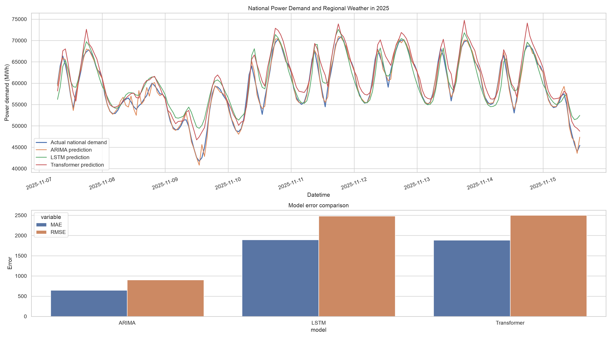
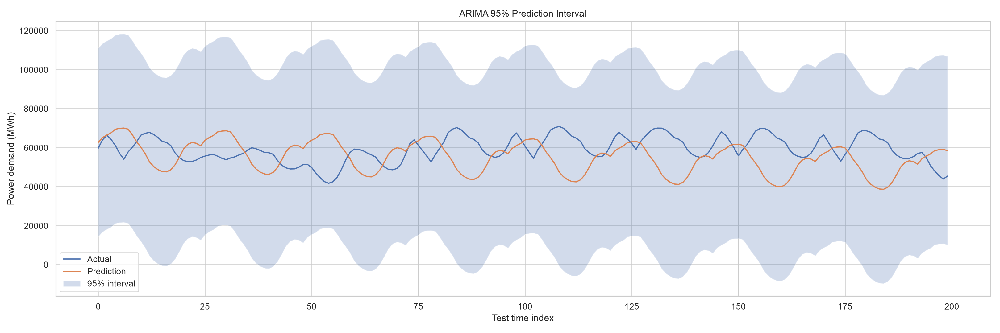
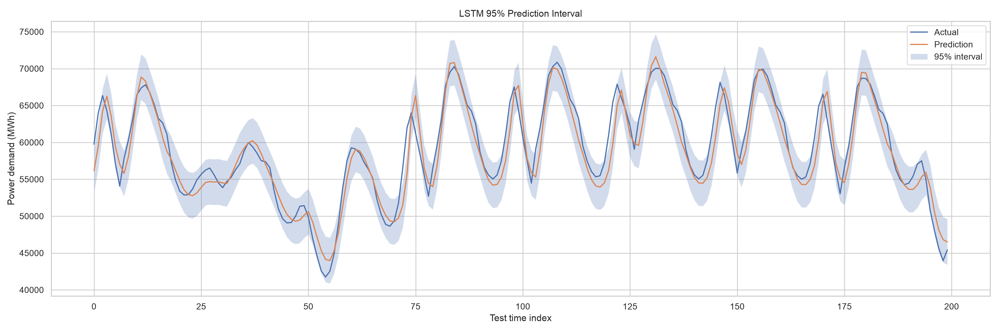
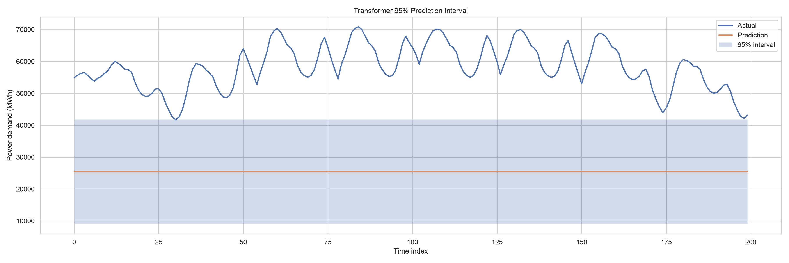

# 전력수요 시계열 예측 프로젝트

이 프로젝트는 시간별 전력수요와 날씨 변수를 활용해 전력 수요를 예측하는 시계열 분석 파이프라인을 구현합니다. 핵심 목표는 다음과 같습니다.

- 고전 시계열 모델과 딥러닝 모델의 성능 비교
- 다변량 입력 기반 예측
- 예측 구간(uncertainty) 시각화
- 실제 전력수요 데이터에 대한 실험 구조 정리

## 데이터

- 데이터 소스: 한국전력거래소 전국 전력수요량 및 서울 ASOS 관측자료
- 파일: `한국전력거래소_시간별 전국 전력수요량_20251231.csv`, `OBS_ASOS_TIM_20260904095916.csv`
- 주요 컬럼:
  - `datetime`
  - `power_demand_mwh`
  - `temperature_c`
  - `rainfall_mm`
  - `wind_speed_ms`
  - `humidity_pct`
  - `sunshine_hr`
  - `solar_radiation_mj_m2`
  - 시간/요일/월 cyclic feature

## 사용 모델

1. ARIMA / SARIMAX
   - 고전적인 시계열 기반 baseline
   - 계절성(24시간) 반영

2. LSTM
   - 최근 24시간의 수요와 기상 정보를 입력으로 사용
   - 장기 의존성 학습

3. Transformer
   - self-attention 기반 시계열 모델
   - 시간적 패턴과 외생 변수의 관계 학습

## 실행 방법

```bash
python energy_demand_forecast.py
```

실행 시 다음 결과 파일이 생성됩니다.

- `forecast_metrics.csv`
- `forecast_predictions.csv`
- `forecast_comparison.png`
- `arima_interval.png`
- `lstm_interval.png`
- `transformer_interval.png`

## 결과 이미지 설명

### 1. 모델 예측 및 성능 비교



`forecast_comparison.png`는 테스트 구간의 처음 200개 시점을 대상으로 실제 전력수요와 각 모델의 예측값을 비교한 이미지입니다. 위쪽 그래프에서는 시간에 따른 수요 변화와 예측선의 추세를 확인할 수 있고, 아래쪽 막대그래프에서는 MAE와 RMSE를 모델별로 비교할 수 있습니다. 최종 실행에서는 LSTM의 RMSE가 가장 낮았고, Transformer가 그 다음으로 낮았습니다. ARIMA는 장기 평가 구간에서 예측값의 변동성이 실제값보다 크게 나타나 상대적으로 큰 오차를 보였습니다.

최종 실행에서는 모든 모델이 동일한 시간순 학습·검증·평가 구간을 사용했습니다. 총 8,760시간을 학습 6,132시간(70%), 검증 1,314시간(15%), 평가 1,314시간(15%)으로 나누었습니다.

### 2. ARIMA 예측 구간



`arima_interval.png`는 ARIMA의 실제값, 예측값, 95% 예측 구간을 나타냅니다. 주황색 선은 예측값, 파란색 선은 실제값이며, 연한 파란색 영역은 모델의 불확실성을 표현합니다. 예측 구간이 넓기 때문에 실제값이 구간 안에 포함되는지는 확인할 수 있지만, 현재 구간은 실용적인 의사결정에 사용하기에는 다소 보수적으로 추정되어 있습니다.

### 3. LSTM 예측 구간



`lstm_interval.png`는 LSTM의 예측 결과와 95% 예측 구간을 보여줍니다. 실제 전력수요는 시간대별로 반복적인 변동을 보이지만, 이번 실행의 LSTM 예측선은 거의 일정한 값에 머물러 실제 패턴을 충분히 재현하지 못했습니다. 따라서 이 결과에서는 LSTM의 학습 또는 역변환 설정을 추가로 개선할 필요가 있음을 확인할 수 있습니다.

### 4. Transformer 예측 구간



`transformer_interval.png`는 Transformer의 실제값과 예측값, 95% 예측 구간을 비교한 이미지입니다. Transformer는 이번 실행에서 ARIMA보다 낮은 RMSE를 기록했지만, 그래프의 예측선은 실제값의 주기적인 변동을 충분히 따라가지 못합니다. 또한 예측 구간이 넓어 불확실성 추정 방식도 개선 대상으로 볼 수 있습니다.

### 결과 해석 시 주의점

현재 95% 예측 구간은 예측 잔차의 분산을 이용한 근사값이며, 엄밀한 확률 예측 구간은 아닙니다. `forecast_metrics.csv`에는 MAE, RMSE, MAPE와 함께 실제값 표준편차, 예측값 표준편차, 표준편차 비율, 95% 구간 포함률이 저장됩니다. 최종 실행에서 LSTM과 Transformer의 표준편차 비율은 각각 약 0.961과 0.963으로 나타나 예측값이 하나의 일정한 값으로 붕괴하지 않았음을 확인했습니다. 향후에는 quantile loss 또는 Monte Carlo dropout을 이용한 불확실성 추정을 적용할 수 있습니다.

## 해석 포인트

- ARIMA는 계절성과 추세를 잘 잡는 고전적인 기준선 역할을 합니다.
- LSTM과 Transformer는 다변량 입력과 비선형 상호작용을 학습해 예측 정확도를 높일 수 있습니다.
- 95% 예측 구간을 함께 제시하면 실제 운영에서 더 유용한 의사결정 자료가 됩니다.

## 과제용 서론 예시

> 본 연구에서는 시간별 전력 수요 예측을 위해 2025년 서울 기상-전력 결합 데이터를 활용하였다. 전력 수요는 시간대, 기온, 강수량, 습도, 일사량, 요일 특성에 의해 크게 영향을 받는다. 따라서 전력수요는 단순한 추세 모델보다 다변량 시계열 모델이 적합하며, LSTM 및 Transformer 기반 딥러닝 모델과 ARIMA baseline을 비교하여 적합성을 검증하였다.

## 참고

- UCI Electricity와 같은 외부 전력 데이터셋은 추가 비교 실험으로 확장 가능하며, 본 프로젝트는 한전 기반의 실제 운영 데이터로 풀스택 시계열 모델 비교를 보여준다.
